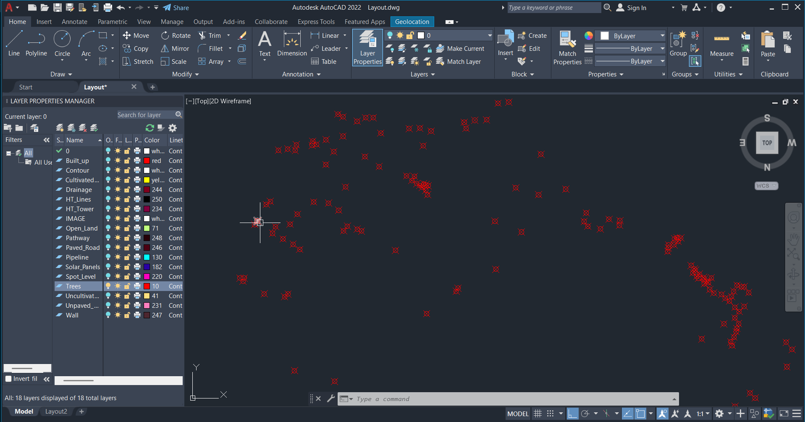
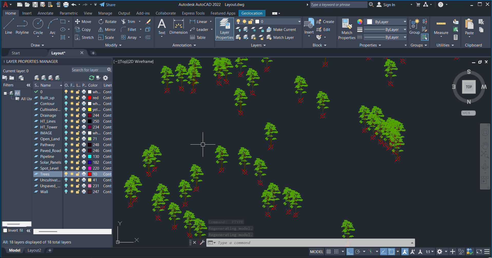

# AutoCAD AutoLISP – Automated Tree Block Placement

An AutoLISP routine for automatically placing tree blocks at selected point locations in AutoCAD.

This tool is designed to reduce repetitive manual work in GIS/CAD workflows where tree symbols need to be placed at multiple existing point locations.

---

## 🚀 Overview

In many GIS and CAD projects, point locations are already available in an AutoCAD drawing. These points may need to be represented using standardized symbols or blocks, such as tree symbols.

Manually inserting a tree block at every point can become repetitive and time-consuming when working with a large number of locations.

This AutoLISP routine automates the process by reading the coordinates of selected points and inserting a predefined `TREE` block at those locations.

### Workflow

**Select Points → Run PT2BLK → Enter Scale → Automatic TREE Block Placement**

---

## 🎯 Problem

The traditional manual workflow requires repeatedly:

1. Identifying the required point locations
2. Inserting the tree block
3. Setting the required scale
4. Placing the block at the correct location
5. Repeating the process for every point

For a large number of points, this becomes a repetitive CAD production task.

---

## 💡 Solution

The `PT2BLK` AutoLISP routine automates the repetitive tree-block placement process.

The routine:

- Accepts selected `POINT` entities
- Supports `AECC_COGO_POINT` entities
- Reads the coordinates of each selected point
- Inserts the `TREE` block at each point location
- Allows the user to specify the insertion scale
- Uses `1.0` as the default scale if no scale is provided
- Processes multiple selected points automatically

---

## 🛠️ Technology

- AutoCAD
- AutoLISP
- AutoCAD Blocks
- GIS/CAD Workflow Automation

---

## 📂 Project Files

| File | Description |
|------|-------------|
| `TreePlacement_AutoLISP.lsp` | AutoLISP routine for automated tree block placement |
| `Before.png` | Input showing existing point locations |
| `After.png` | Output showing automatically placed tree blocks |

---

## ⚙️ How to Use

### 1. Prepare the Tree Block

Before running the routine, make sure a block named:

```text
TREE
```

is available in the AutoCAD drawing.

The routine uses this predefined block name when placing tree symbols.

### 2. Load the AutoLISP Routine

1. Open AutoCAD.
2. Type `APPLOAD` in the command line.
3. Select `TreePlacement_AutoLISP.lsp`.
4. Click **Load**.

### 3. Run the Command

After loading the routine, type:

```text
PT2BLK
```

in the AutoCAD command line.

### 4. Select Points

Select the required point locations from the drawing.

The routine supports:

- AutoCAD `POINT` entities
- Civil 3D `AECC_COGO_POINT` entities

Press **Enter** after selecting the required points.

### 5. Enter Scale

Enter the required insertion scale when prompted.

If no scale is provided, the routine uses:

```text
1.0
```

### 6. Automatic Placement

The routine reads the coordinates of the selected points and automatically inserts the `TREE` block at each location.

This eliminates the need to manually insert the tree block at every point.

---

## 🎬 Demo

A short demonstration of the AutoLISP routine showing the automated placement of `TREE` blocks at existing point locations.

The workflow converts selected AutoCAD points into `TREE` blocks automatically, reducing repetitive manual placement work.

---

## 🖼️ Before & After

### Before – Point Locations



### After – Automated TREE Block Placement



---

## 📥 Download

The AutoLISP routine is available in this repository:

[`TreePlacement_AutoLISP.lsp`](TreePlacement_AutoLISP.lsp)

Load the `.lsp` file into AutoCAD using **APPLOAD**, then run:

```text
PT2BLK
```

---

## ✨ Key Benefits

- Automates repetitive tree-block placement
- Supports multiple point locations
- Supports AutoCAD POINT entities
- Supports Civil 3D COGO points
- Uses existing point coordinates
- Allows user-defined insertion scale
- Reduces manual CAD production time
- Useful for GIS/CAD workflow automation

---

## 📌 Requirements

- AutoCAD
- AutoLISP support
- A predefined block named `TREE`
- Point or COGO point locations in the drawing

---

## 👨‍💻 Author

**GeoPythonwithBapan**

GIS | Remote Sensing | UAV | AutoCAD | AutoLISP | GIS/CAD Automation
